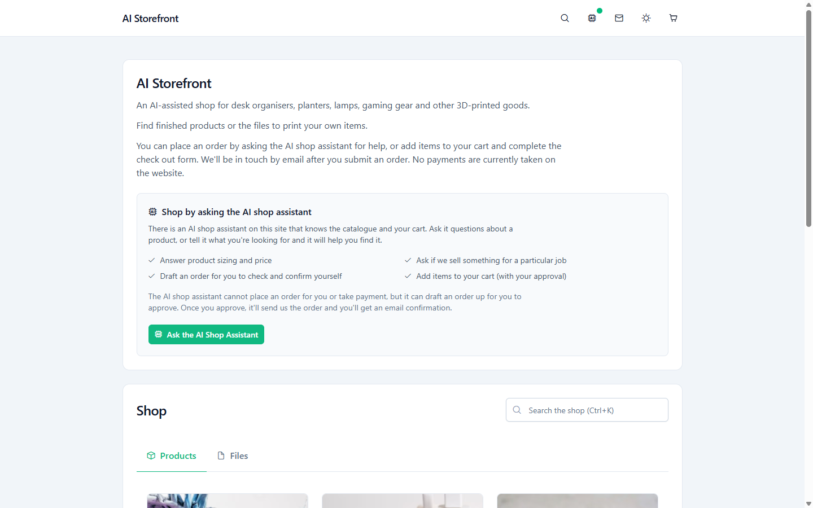
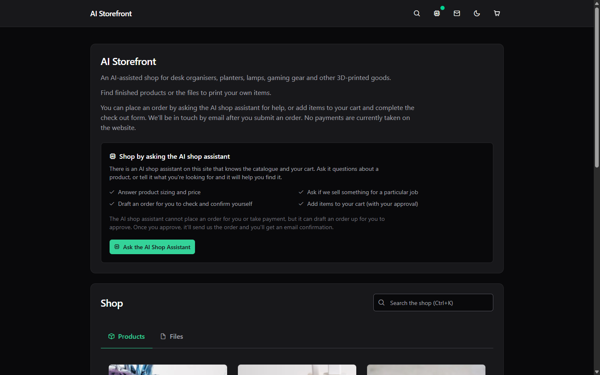

# AI Storefront

A Nuxt 4 storefront template with a shopping assistant, and a request-an-order
checkout: customers build a cart and submit it, staff receive the order by email
and arrange payment off-app.

**Live demo: [ai-storefront.bobdempsey83.com](https://ai-storefront.bobdempsey83.com/)**



The same page in dark mode, which the navbar toggles and the page applies before
first paint:



## Stack

| Concern | Choice |
| --- | --- |
| Framework | Nuxt 4 (SSR) + Vue 3 + TypeScript |
| UI | PrimeVue 4.5.5 (Aura theme) + Tailwind CSS 4 |
| State | Pinia, persisted by `pinia-plugin-persistedstate` (cart to a cookie, theme to `localStorage`) |
| Data | Supabase (Postgres + RLS) |
| Email | Resend |
| Validation | Zod |
| Images | `@nuxt/image`, resized on demand (IPX locally, Vercel's optimizer on deploy) |
| Theming | Light/dark toggle in the navbar, applied before first paint |

## Setup

1. Install dependencies (npm needs `--legacy-peer-deps` on this Nuxt version):

   ```bash
   npm install --legacy-peer-deps
   ```

2. Create a Supabase project, then run `supabase/schema.sql` followed by
   `supabase/seed.sql` in the SQL editor.

3. Copy the env template and fill it in:

   ```bash
   cp .env.example .env
   ```

   One entry deserves a moment: `NUXT_TRUSTED_IP_HEADER` names the only header
   the rate limiter will believe about who is calling. A header the client can
   set is not an identity, so anything else is ignored. Use
   `x-vercel-forwarded-for` on Vercel (the default), `cf-connecting-ip` behind
   Cloudflare, `x-forwarded-for` behind your own nginx or Caddy, and leave it
   empty when Node faces the internet directly. Naming the wrong one costs you
   nothing worse than limiting every visitor as if they were the same person.

4. Start the dev server:

   ```bash
   npm run dev
   ```

5. Run the tests:

   ```bash
   npm test              # typecheck, then the unit tests, no network
   npm run typecheck     # types only
   npm run test:unit     # unit tests only, for the fast inner loop
   npm run test:e2e      # browser, needs a dev server (starts one if needed)
   npm run test:db       # writes to the live Supabase project
   npm run test:smoke    # checks the deployed site
   npm run test:llm      # real provider calls, the only script that costs money
   ```

   `npm test` typechecks the app, the server routes, the components and the
   tests before it runs a single assertion, so a type error fails the run the
   way a failing test does. It costs about 20 seconds against the unit tests'
   3, which is why `test:unit` exists for the loop you run on every save.

   The conventions behind that split are in [AGENTS.md](AGENTS.md).
   `test:smoke` defaults to this template's own demo at
   `ai-storefront.bobdempsey83.com`; set `SMOKE_BASE_URL` to check yours.

6. Lint:

   ```bash
   npm run lint          # ESLint, type-aware rules, about 17 seconds
   npm run check         # typecheck, lint and unit tests in one pass
   ```

   The lint sits outside `npm test` because together they ran 36 seconds, past
   the budget the change that added them set. Run `npm run check` before you
   push; run `npm test` while you work.

7. Continuous integration:

   `.github/workflows/check.yml` runs `npm run check` on a push to either
   long-lived branch, `main` or `fif`, and on
   every pull request. It runs nothing else on purpose. `test:db` and `test:llm`
   write to your live Supabase project and spend provider calls, and `test:e2e`
   and `test:smoke` need a running server or a deployment, so none of them
   belongs on a pull request from a fork. Fork this template and the workflow
   comes with it, needing no secrets.

## Database types

`server/types/database.ts` is generated from the live Supabase project and
committed, so every `.from(...)` and `.rpc(...)` call in `server/` is checked
against real columns. Regenerate it whenever you change `supabase/schema.sql`
and apply that change:

```bash
npm run db:types
```

The script needs `SUPABASE_ACCESS_TOKEN` in `.env`, a personal access token
from the Supabase dashboard, scoped to the project and read-only. It is read
only by this script: neither the build nor the running app touches it, so a
deployment does not need it.

A schema change without a regeneration shows up as types that disagree with the
SQL in the same diff. Nothing enforces the regeneration, so the typecheck is
only as current as the last run.

`products.kind` is a Postgres enum, so the generated row says
`'physical' | 'digital'` rather than `string`. The three file columns are not:
they are tied to the kind by a check constraint, and no Postgres type says
"non-null exactly when `kind` is `'digital'`", so the generator writes
`file_name: string | null` for both kinds. `server/utils/rows.ts` narrows them
back at the one point a row leaves a query.

If you convert another column to an enum, note what bit here: Postgres stores a
check constraint with its literal already cast, as `kind = 'digital'::text`, so
**every** constraint mentioning the column has to be dropped before the
conversion and added back after it. Missing one fails the migration with
`operator does not exist`.

## Contributing with AI agents

This project uses [OpenSpec](https://github.com/Fission-AI/OpenSpec) for
spec-driven development: agree the spec before writing the code. See
[AGENTS.md](AGENTS.md) for the working agreement, and `openspec/` for specs and
in-flight changes.

```bash
npm install -g @fission-ai/openspec@latest   # requires Node 20.19+
```

In Claude Code: `/opsx:explore`, `/opsx:propose`, `/opsx:apply`, `/opsx:archive`.

## Order flow

1. Cart stores product IDs and quantities only — never prices.
2. `POST /api/cart/preview` resolves those IDs to current catalogue prices.
3. `POST /api/orders` validates the payload, rate-limits by IP, then calls the
   `create_order` Postgres function.
4. `create_order` prices the lines from the `products` table, rejects
   out-of-stock items and writes `orders` + `order_items` in one transaction.
5. Resend emails the order to staff with `reply-to` set to the customer, then
   sends the buyer their own confirmation. Neither send can fail the order,
   which is already committed by this point.
6. Staff read the order in the email or the Supabase dashboard.

## Security notes

- The Supabase **service role key is server-only**. It never reaches the browser
  and there is no anon key in the client bundle — all data goes through Nitro.
- RLS is enabled on every table. Only `products` is publicly readable.
- Prices and totals are computed in the database, so a tampered cart cannot
  change what is ordered.

## Phase 2 candidates

- Cloudflare Turnstile on the order form
- Admin order screen (Supabase dashboard covers MVP)
- Product variants and categories
- Real payments (Stripe Checkout via a Nitro route)
